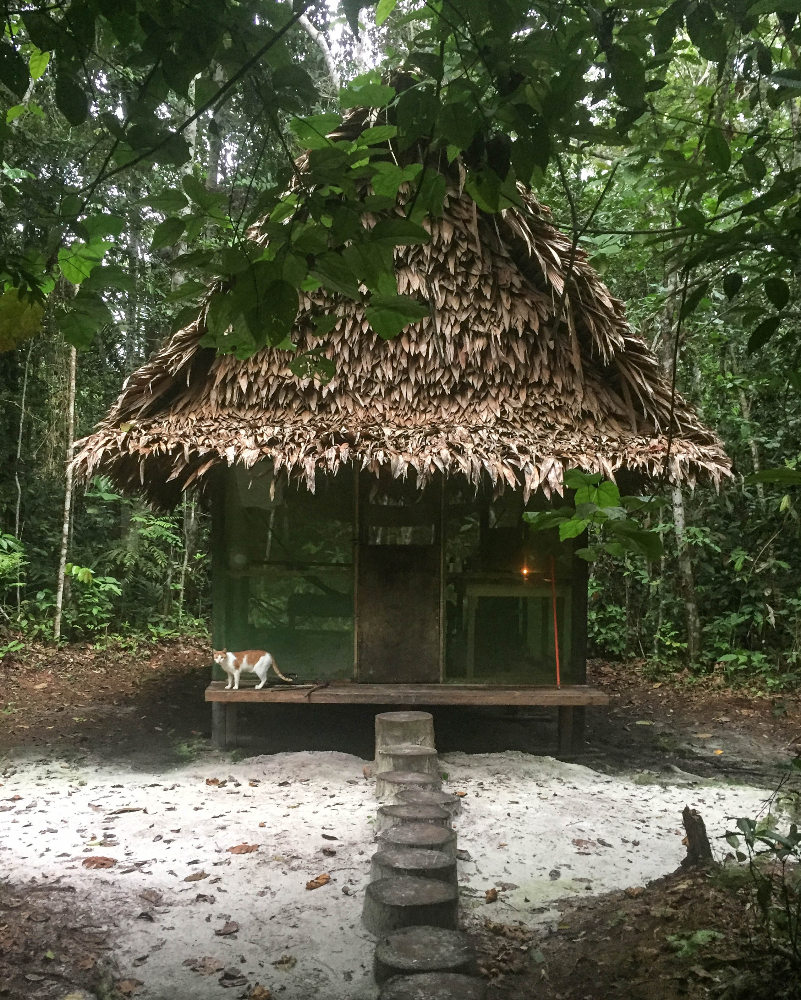

### Sonic Injury
October 3, 2015, was the fateful night that I attended a blues performance by the Denis Jones Band at Harvelle’s nightclub in Santa Monica and sustained hearing trauma, which took me on a difficult and wonderful journey through suffering, healing, and learning.

I’d just attended [Visionary Convergence](https://www.plantteachers.com/program/) in L.A. the week before, a psychedelics and plant medicine conference, and was riding a wave of joy: many friends were at the conference, I'd attended many fascinating presentations, and I just had a great time. The conference was like being back in college, but where each lecture is fascinating and there’s no need to take notes and no tests, just hanging out and reconnecting with friends, discussing excitedly which talk we’re most interested in attending next, and what impacted us from the one we’d just attended. The speakers felt like accessible stars of the psychedelic and plant medicine world: people who had probed far into consciousness and brought useful, interesting, and hopeful things back.

The next week, still riding that social and spiritual high, I accepted an invitation from some older friends to attend a blues performance. I figured I'd wear my trusty Etymotic -20dB musician’s earplugs, which had worked effectively in some pretty loud places before. I knew I had sensitive hearing, so I was careful to use protection religiously. At this performance, I wore my earplugs for the whole time: my friends and I stayed for a couple hours. I didn’t drink, and just tried to observe, appreciate the vibe, and the musicianship and Dennis' electric guitar-playing skills, hanging out with my friends. It was pretty darn loud in there, but never occurred to me that my earplugs wouldn’t be enough.
### Turning Up the Gain
On leaving the venue and returning home to my quiet room, I first perceived the tinnitus start up: it was as though input to one frequency was missing, so circuitry associated with that frequency turned up the gain. And... kept turning it up, further and further... until background “noise” in the cellular environment itself became the entire basis of what I heard for particular frequencies. The hiss one hears when turning up the volume knob of an amplifier on a silent line is analogous, except imagine that this hiss (white noise) is limited to a high band, and the gain turns it up louder and louder.

The condition worsened over a period of a few days. I heard a very high frequency, like the whine of an old CRT TV if you remember hearing that as a kid, only much louder. Sometimes it would quiet a bit, and I felt my brain in the realm of that frequency "listening", trying to hear something, before turning up the gain again. I kept trying to tell that part of me, "no, don’t do that! There’s nothing interesting there, please turn it down!" ...But it wasn’t working. The gain would turn up, and the frequency's loudness would then get stuck. I could only hope that it would relax and give up later... The high-gain condition would sometimes vary, but I had to accept that maybe it would be a few nights before it would relax, so I would have to just go to sleep with it this way. Maybe I could do something that would shake up the wiring and cause the frequency to release: So for the first few days/nights with tinnitus I was hopeful; perhaps also the circuitry would figure out the “problem” and resolve on its own.

> While voices carry meaning — whether this is trivial or portentous — some auditory hallucinations consist of little more than odd noises. Probably the most common of these are classified as tinnitus, an almost nonstop hissing or ringing sound that often goes with hearing loss, and may be intolerably loud at times.” [Oliver Sacks, *Hallucinations*, p.64-65.](https://en.wikipedia.org/wiki/Hallucinations_(book))

Tinnitus is a funny thing. You can tell people about it, but because they can’t hear it, it doesn’t exist in their reality. It is an entirely inner, hallucinatory experience within the sensory apparatus of one person. It’s not a particularly *interesting* hallucinatory experience per se, although perhaps the term is not correct; a hallucination could refer to something that one cannot through the senses distinguish as being real versus unreal. I always knew that the extremely high-pitched sound I could hear did not represent anything in the outer world.
### Searching for a Cure
I started researching potential treatments, in particular searching/browsing [ClinicalTrials.gov](https://clinicaltrials.gov). I found one trial by a German pharmaceutical company which looked promising: A substance code-named AM-101 would be injected into the ear, and this would somehow reset the auditory mechanism and help cure acute tinnitus on a physical level. I applied for that one; it was worth a shot. The window for treatment for this trial specified that the patient be within three months of the hearing trauma. A woman called me back about two and a half months after I’d filled out the application, and asked me what date my trauma had occurred. I wasn’t exactly sure, so I thought fast: there was a temptation to lie and say that it had been recent, but not recalling the exact date at that moment, and feeling under a lot of stress, I synthesized my answer by subtracting a little less than three months from the present date of the callback. The way the math worked out, unfortunately, I was just outside the window to qualify for the trial: I’d be out of range of the dates I could go to a conveniently-located clinic in Santa Monica. Although the study was being done with worldwide participants, and I was located conveniently near a local participating office in Santa Monica, my own participation was just barely out of reach.

This was a difficult time for me, feeding from the strength and repetitiousness of negative thinking related to the condition. I had a simultaneous feeling of desperation, while my rational side championed the need to accept and do my best. I also thought about the clinical trial, reflecting: should I have lied about the date of the trauma so that I could have qualified? I definitely had the opportunity to. When I initially spoke with the woman who'd called me back, I said, "I think the trauma was on such and such date, but I need to check my records" (go back in my email history and find the invitation from my friend to attend the blues performance) "and then I’ll call back and give you confirmation of the exact date." This is when I thought, ok, I can give her a slightly different date that is more recent. Guiltily, I imagined the person on the other end might already know that desperate people are tempted to adjust details when a promising treatment is just out of reach, and imagined her suspicion. (I’d read reports in online forums from some individuals who had undergone the AM-101 therapy being studied, who reported that their tinnitus had been healed.) So, I was frustratingly close. Also, the manufacturer had published on a website advertising the study: “If you’ve suffered acute hearing injury resulting in tinnitus, it’s important to treat it fast, because otherwise the condition can move more deeply into the brain where it becomes permanent and not possible to treat.” So I was facing this imagined ticking clock: _If I don’t fix it now, then I may not be able to_. I also saw, though, that there was a between-three-and-six-month window for which a projected trial was to be done with this same medication. So that gave me some hope that maybe it could be fixable in that range, as well.
### A Brief Glimpse of Silence
A few weeks after I’d been hit with this condition, I went to a Shpongle concert in L.A. and took a half dose of LSD both to enhance the experience and explore whether it could help my brain. I wore my new -30 dB musician’s plugs (I didn’t trust my Etymotics anymore, and had looked for something even stronger). I was also asserting that I didn't want to just stop going to cool musical events for the rest of my life; I wanted to find a way to do this safely, and surely the volume at that Harvelle's performance was... anomalously loud. The tinnitus wasn’t that horrible during the daytime, now; it was just at night that it would really bother me. After the concert, which was in fact loud, but not _too_ loud, I perceived energy shifting about in my body, and it seemed in my hearing system as well. There was a small window of time when I was back home, in the quiet of my room, lying in bed, that the tinnitus stuttered, faded out, and then for a minute I was free! ...And then the gain mechanism rebooted itself, attentional networks I didn't have volition over focused within the damaged frequency, and the tinnitus came back. There had been a moment of hope (that the LSD would "shake up the snow globe" and help nerves that were stuck in a wired-together state separate and reconfigure, perhaps), and I received a subjective glimpse into the brain mechanism surrounding my type of tinnitus, but that's all. Perhaps, in the future, higher-dose psychedelic experiences, combined with the application of particular frequencies, might be a potential therapy for tinnitus: Paul Stamets said something intriguing at the 2017 Psychedelic Science MAPS conference, involving the combination of psilocybin and lion's mane mushrooms, as being synergistic for healing hearing. I'm also curious about the amplification in neuroplasticity during and after the acute effects of psychedelic substances.
### Learning to Live With It
Over time, my tinnitus faded a bit in intensity. In the beginning, it was particularly distressing. I had one very hard night where I was woken up by the sound and wrestled with nearly suicidal thinking: _If I have to go through life with this constant companion_, I thought, _this constant shrill scream in my head, then I would choose not to_. These were emotionally driven thoughts, from the intensely conscious frustration of focusing on this highly unpleasant sound, itself connected with the idea of injury or trauma to bodily integrity, associated also with intense regret/anger. I was intensely angry at Dennis, at the band, at the venue. How could it have been _so_ loud in there that even _with_ hearing protection, this had happened? My mind would move habitually to distressing thoughts about how bad this all was; I had to learn how to be in more control of my thoughts. Regular meditation helped: I learned to focus on my breath and notice when thoughts about the tinnitus would arise; I could let them go, and slowly, over weeks, I felt less distress. One thought would still come, frequently (itself, negative, but more subtle): “even though you can let go of negative thinking, this sensory input is still coming into your consciousness, and you can't do anything about that.” I remember going for a run and really struggling to keep my mind from its preoccupation with the tinnitus, with obsessively checking on it and thinking about it. I had to keep moving my focus of attention back to my breath, and this helped in getting better, bit by bit, at going for increasingly longer periods without preoccupation with the sound.

Rather than try to ignore it, I also found it beneficial to sometimes listen intentionally and focus in on the frequency, because I knew that it was part of my body/mind sensory apparatus, which itself needed conscious attention or "love". To push it away wouldn’t work; I needed to listen to "what it was trying to tell me", as it were, and do this with the energy of self-acceptance and even gratitude, somehow. I tried to incorporate that "attitude of gratitude", trying to hold the posture that from a spiritual perspective, somehow, even though I didn’t understand it yet, even _this_ was an important part of my life journey: an important teacher, of some kind. So day by day, something was slowly changing. There seemed to be something paradoxical about focusing on having gratitude for something I really didn’t want simply because I couldn’t get rid of it, but that seemed like a higher path than holding inner resentment or pushing against this immovable wall. I focused on changing the story I told myself: It may sound sappy, but I experimented with thoughts like, “this sound is the voices of the highest angels communicating with you...” If you're old enough you'll remember the hiss of a modem connecting your computer to the early Internet or other networks over a phone line; maybe this was like a spiritual modem link into my brain, or something... at least I could play with the story.

Sometimes the sound would wake me up at night, although thankfully this wasn’t too frequent. I noticed that it would be much louder in the morning before I got out of bed; once I was no longer horizontal, it didn't seem as intense. I had one dream which presented my frustration in a very visual form: *The sliding window of my bedroom (I was in the high school era of my life, in the dream) is open, and someone is operating a chainsaw in the yard next door, below my window. I close the window so it will be quieter inside, but it has no effect; the sound is just as loud as it was before.* I woke up thankful that my tinnitus wasn’t quite as loud as that chainsaw in my dream, but the concept of inability to change or prevent meaningless and annoying sensory input from something in the perceptual system was just as real.

I moved up to Berkeley for a few months and there were moments of despair during my drive. Not just connected with the tinnitus; there was a part of me which felt a lot of emotional overwhelm. I pulled over before arriving and cried a little bit, shallowly, which was the best I could manage, and felt a little better. My experience in the Bay Area came together well. I rented a room in a house to live in, and focused on artwork and other projects. During this time I found that listening to music felt great to my brain. Aerobic exercise at the gym, or running in the hills, helped with the feelings related to the tinnitus as well. While listening to complex, detailed electronic music, I might stop noticing the tinnitus altogether. Perhaps I could find it if I hunted for it, but I was able to focus on the music and shift my attention from the unwanted sound, particularly with headphones (which provided a more immersive sensory environment). Because it was extremely quiet and peaceful in the room I’d rented up in the Berkeley Hills, I was very aware of the sound while sleeping and waking up, but I had gotten used to it by this point; I’d realized that pretty much any thought about it wasn’t of any benefit, and so the best thing to do was, to the best of my ability, not think about it; in fact I was thinking about it less and less. It felt like a small victory when I’d be on the phone and notice, on hanging up after an hourlong call, that I hadn’t had a single thought about the tinnitus. I felt proud of myself; this was the nature of that bittersweet accommodation or habituation. In this respect, I appreciated the condition as a teacher: I learned how to have greater control of my thoughts.

I also began working something symbolic into my artwork, about the tinnitus: a solid line or band across the top of each little piece I made, representing the damaged frequencies. It felt like a small act of expression in reflection of my difficult inner experience.

[insert artwork here]
### Notched Audio?
Every once in a while I’d check [ClinicalTrials.gov](https://clinicaltrials.gov/), but there wasn’t anything promising there. I read as much as I could about how to treat tinnitus. I found a promising therapy called “audio notching” whereby one finds the exact frequency of the phantom sound, and can construct a sound file consisting of white noise (audio snow in which every frequency is equally represented), which has been created so that a very narrow band is missing, centered around the tinnitus frequency. By listening to the custom sound file with earphones, every day, neuroplasticity will start to take effect. The brain will start to devote more processing capacity to all of the other frequencies, and areas of the brain devoted to the missing frequencies will shrink, yielding a lower perceived volume of the tinnitus frequency all the time. I used a tone generator on one website to try and identify my precise tinnitus frequency, but had a lot of trouble, because the frequency is so high. I could have continued on this path, but actually wanted to pursue a complete cure, not just a decrease in signal volume. Rather than the idea of minimizing the input of this traumatized and problematic inner circuitry, I actually wanted to maintain awareness of it, so that I could be conscious of actual healing and regeneration within that part of my sensory apparatus.
### Back to the Jungle
It was earlier in the year, after I had received this trauma, that I had decided to go back to [Nihue Rao](https://nihuerao.com/), an ayahuasca center in the Amazon rainforest of Peru. Having already spent a cumulative four months dieting and working with natural plant medicines and expanded states of consciousness, across two visits, I’d had the intuition that I wanted to go back for a third time. My first two-month retreat had been an amazing, eye opening, and deeply healing experience. Upon returning home, there was the sense that my work was incomplete; I had sensitivities and discomforts in life and wasn’t quite sure yet what to do. I didn’t want to just go back and get a “regular” job, and yet I did some interviews, anyway. After my second two-month retreat, I’d spent half a year exploring and going to many music festivals, not exactly sure what I was looking for, yet starting to discover things that felt more aligned with my life.

So, I was comfortable going deep: I booked a _three_-month retreat at the ayahuasca center, which felt like my second home in the rainforest. My main intention was to heal my hearing trauma, of course. I had imagined, back home, that the Shipibo medicine cabinet might contain specific plants which were _known_ for their ability to cure trouble to the hearing systems. But under what conditions would tinnitus arise naturally, though? In cultures living very close to nature, how would this happen? A big cat has roared too close to one’s head, I pondered? But I trusted this modality and its ability to heal what is inaccessible to Western medicine: by collapsing the mind/body duality, and through that spiritual portal, unlocking physical healing (in fact, showing us how spiritual/physical is itself a limiting duality).

I had also been thinking, from a spiritual standpoint, that the hearing trauma could be interpreted as “the plants calling me back”. My own narrative overlay or retrofit meaning-making, perhaps, or perhaps not: because I probably wouldn’t have come back to the jungle to do a three-month dieta, otherwise, which itself was the adventure of a lifetime and deepened my relationship with this medicine and the Shipibo healing modality, which has become an important part of my life. So, I’d been lightly entertaining this thought. (Reflecting on my path deeply has showed me how an unconscious drive towards healing and wholeness can steer a life trajectory; we may feel guided by outside forces, only realizing much later what our choices were really serving. What on the surface seems to be about one thing, may much more deeply be about another thing that is closer to the "core" of a larger potential life-purpose.)
### Plant Prescription
In my consultation with Ricardo (the master shaman / healer at Nihue Rao) after arriving, I communicated my intentions. He prescribed a master plant called _ayahuma_, a large rainforest tree. The effects will be a lot stronger, I’d been told, by a friend who had dieted with this tree before: this is a more difficult plant to work with. I’d kind of been hoping for something very _specific_, for the maestro to say, “ah, hearing damage, take this specific (and uncommon) medicinal plant...” just as in the West we have specific distinct medicines approved for very specific health issues. But in the world of plant shamanism, that is not necessarily the case, and I quickly began to appreciate why.

_Everything is connected_. Even though in my mind the hearing trauma was an isolated and unfortunate incident, in reality, everything is important. For example, why did I not leave the venue earlier, and continue to hang out even past the point that I felt much interest in the music? Why was I in a social situation in a society where people listen to such extraordinarily loud sound, perhaps numbing ourselves with alcohol and volume? What about the energy carried in the music itself, the emotions of the performers, the _meaning_ in the music? What about my own relationship to my body, the way I felt about and interacted within myself, my own more subtle inner signals? The ayahuma started dredging things up.

While it would have been nice to say “oops, sorry” and undo that night at Harvelle's, in fact it was a nexus point in life where the signal itself of other forces might have found a way to punch through, in a way which definitely got my attention. Over the course of my three-month diet, the healing (on many inner levels) and learning was profound. Healing the hearing trauma was a component of the journey, which unfolded as follows.
### The Rainforest as Sound Medicine
For longer-term dieters at Nihue Rao, the guest may stay in a tambo, which is a screen-walled hut embedded in nature. The particular tambo to which I was assigned was farther into the forest than any of the others; this meant that I slept and spent much time deeply ensconced in the rainforest noises: the continual buzzing, chirping, tweeting of bugs, birds, bees. In fact the rainforest sounds were _so_ loud that I immediately noticed: hey, I actually _can’t tell_ whether what I’m hearing is from my tinnitus, or from the surrounding environment: a perfect sonic masking. Many times I resisted the urge to plug my fingers into my ears in order to check whether the tinnitus was present, and appreciated the idea that this "organic" natural sound, the multidimensional richness of life around me, while loud, held soothing and comfort.

During my three-month diet, I had many dreams, often with particular vividness. I would wake up and write notes, which I'd expand in the morning. I got better at recording, writing out, and reflecting on my dreams: One of the primary ways I'd commune with the spirit of ayahuma and other plants I'd dieted was through prolific dreams. (With respect to ayahuma, sometimes I would catch a particular rendering quality in the dream: a cartoonish, graphic novel finish to the perceptual world.)

### The Spirit of the Damaged Frequency
One of the key dreams I had helped guide the course of healing my hearing, and is an interesting case study for how plant spirits can interact with us. I had just drunk a big bowl of liquid made from the inner bark of the ayahuma tree, ingesting the plant as a way to connect with its medicine through my body. The following is essentially verbatim from my journal at the time:

> ...[I] was able to fall effortlessly asleep, dreaming right away. My dreams were lucid but not that controllable. I examined the awesome rendering system and physics engine by tossing a piece of styrofoam which floated on the air. Before this I moved around in the world and examined it a little. I was on my block and moving away from my home. This was uncomfortable and I turned back. There were emotionally cold currents but I held on. I looked at my hands and saw them stretching horizontally.
> 
> There were intense feelings, presumably from ayahuma. It's like I'm inside the wood, and it is doing work on me. It is not comfortable, but it is not painful. It's like electric current going through my whole body or coursing through parts of it. There was frequency shuffling through my hearing system, first in the lower registers, and then with some overtones that reached higher. Like riffling through the hair cells [in the cochlea] with a comb. [...] I feel the examination and direct healing.
> 
> I asked, show me my tinnitus. I was shown a spectrum analyzer type display yet it also felt very intense. I felt reassured that my system could handle it. I felt the overload and could see a sort of hole in the analyzer's frequency map. I pulled out of this view. Perhaps this is showing me the conditions under which the damage occurred.
> 
> Next I asked to be shown how to heal it. I was shown little girls in a classroom, slightly cartoonish looking. They were wearing uniforms and I could see their socks over skinny legs. The view panned up and I saw the face of a girl who seemed hateful or mean. She had orange hair and there was a blast of cold air against the left side of my chest. I held on and tried my hardest to love her, with her meanness blasting at me like a cold jet engine. I kept saying, I love you. Her face morphed into that of a young woman, round and with short hair, like Patty from [the] Peanuts [comic strip], a little. She looked happier, but there was still distortion. I saw cartoonish pine trees and with perhaps a house. The view faded and was dark.

As I woke up from the dream and reflected, I “trusted” the answer which seemed, beyond a doubt, to have been received or given to me directly in this form from the ayahuma spirit, in response to my request ("how do I heal this?"). The girls in the classroom must represent frequencies in my hearing system. I understood that the mean and spiteful girl must represent _the particular frequency_ which had sustained trauma. The intensity of her emotions must be an emanation of all of the stored negativity I had felt because of my tinnitus, towards this part of me. I understood that the answer to my question, “how can I heal this?” was: heal my relationship with that red-haired girl, as a visual symbol for a tiny part of my body.
### Healing the Red-Haired Girl
In an ayahuasca ceremony, the boundary between reality and what is in the imagination can blur: imagination can become much more "active" and expanded, and we can perceive the feelings and impacts of thoughts on the body, and vice versa: the impacts of experiences and how the feelings of those experiences have impacted the body. The imagination and the mind can be used in a more deliberate way, because feelings in the body are amplified in concert: ayahuasca truly shows us the inseparability of mind and body as one unit, like two sides of the same coin. I addressed my attention to the girl, in my imagination: I started by apologizing, saying: “I’m so sorry, I should have taken better care of this body, which I’m responsible for. You have every right to be angry at me, for as long as you want. I accept your anger.” I went on in this vein for a while, with the intention of relational repair. Towards the end of the ceremony, I had the sense that she was feeling better, and we were able to sit side-by-side on a hill overlooking a landscape. For the remaining two months, I would periodically check in on her.
### What Changed
After my diet, upon returning home, I remember a moment clearly, walking in L.A. (of course), where I stopped, looked around, and tuned in to my own tinnitus. I found that the phantom sound itself was somewhat diminished; more importantly, I was _incapable of entertaining negative thoughts about it_. It remained a feature of my sonic landscape, but held almost no interest to my mind's attentional networks. Gone were the negative thoughts and really _any_ thoughts about it.

How did this happen? Although the whole interaction was in my imagination (first, through a dream; then, through intentional work within my mind / active imagination under the effects of ayahuasca), I sensed that I was not _simply_ imagining the feelings of the girl. She was symbolically a “handle” which allowed healing between parts of myself. "I" as my conscious free-willed narrative center, or egoic self, could then take responsibility and integrate the lessons of the difficult feelings from the trauma, and thereby drain the situation of its emotional charge. At the same time, the ayahuasca worked on my overall nervous system tone, slowly cleaning out stress, itself within a meaningful and visionary process. In a general sense the unfolding narratives themselves, and the meanings we make, reveal why we call these medicines "plant teachers" or "master plants", with "master" used in the sense of "maestro", as in a teacher or expert.
### Ten Years Later
It's now over 10 years since I first incurred that trauma. I'm still very protective of my hearing. I can feel activated or triggered (it feels like an emotional dissociation) if I'm exposed to too much volume without protection, and will wear my musician's earplugs ([Eargasm](https://www.amazon.com/s?k=eargasm) brand works great for me) even in social environments that feel uncomfortably loud. The deep nervous-system-level trigger is connected with a deep worry that I might make the tinnitus worse. I also observe how the perceptual loudness of the sound is directly connected with stress; it's therefore a barometer for internal stress, in a sense. I also notice sensitivity to particular frequencies, if exposure is sustained. When I was a kid, I would play the upright Yamaha piano in our family's music room, without a care. Now, I wear musician's earplugs when practicing piano: but this means I can really bang the keys, and feel the vibrations of the instrument. Pianos just sound loud to me. When an ambulance or fire truck passes by, I plug my ears with my fingers. Some musical environments (concerts) are just too loud, even for foam earplugs, and I suffer if I hang around too long. I plan to get some over-ear sound protection, to wear together with musician's plugs, to be able to tolerate such environments.

And yet... 99% of the time, I don't think about the tinnitus. It doesn't bother me. It's just here, a sensory feature of this human body. I'll gladly accept a cure, and I know so many suffer much more than I have.

The cure for me was not the disappearance of the sound, but rather the disappearance of my war with it. My unique angle of exploration here is in response to the question, "can ayahuasca heal tinnitus?" And my answer is "yes, but not in the way you think." I've been through it.